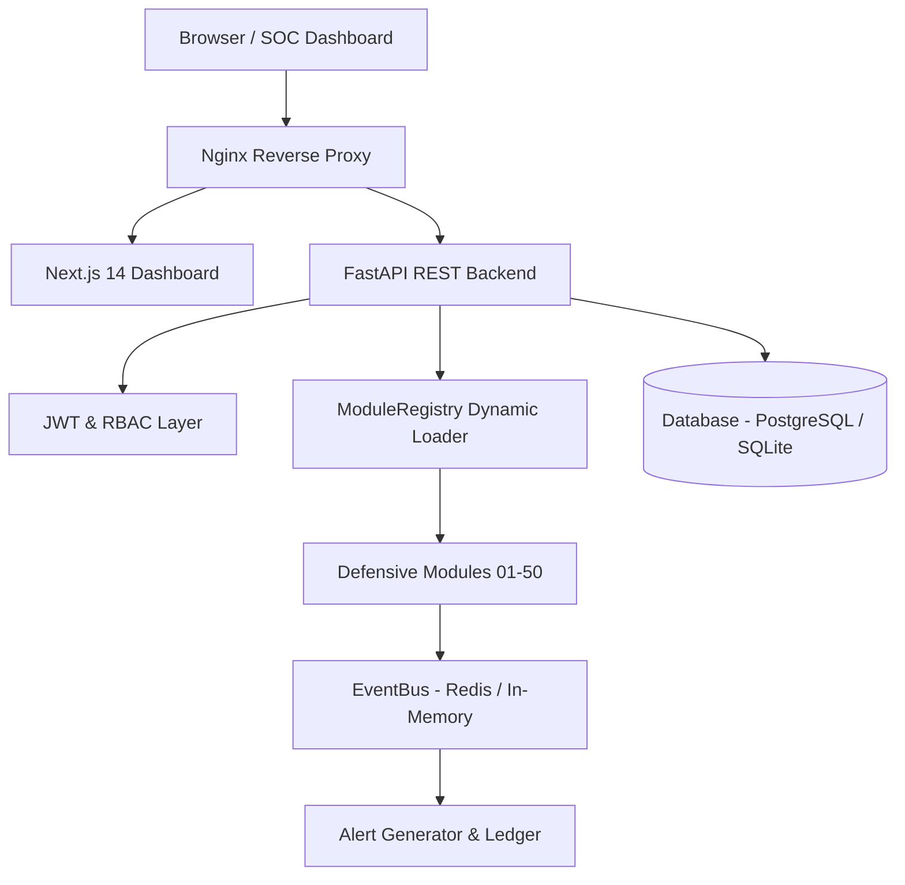

# System Architecture

## Component Interaction

## Relational Database Tables
1. `users`: Identity and authentication records.
2. `modules`: Module metadata mirroring `platform.config.json`.
3. `module_executions`: Execution lifecycle history.
4. `security_events`: High-throughput telemetry detections.
5. `logs`: Centralized audit and application logs.
6. `alerts`: Actionable security alarms with resolution flags.
7. `reports`: Structured module findings.
8. `configurations`: Scoped runtime settings overrides.
9. `audit_log`: Immutable user action audit log.
